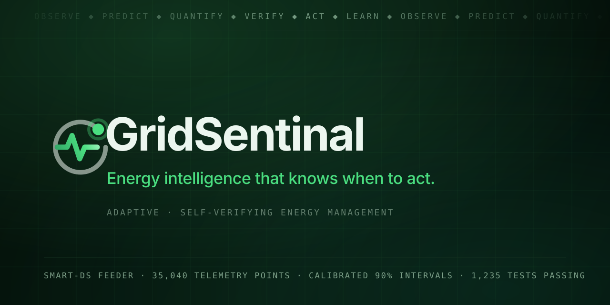

# Energy Intelligence



**Adaptive, self-verifying energy management** — Yuva Yodha Energy Tech Hackathon 2026, Schneider Electric.

The project aims to answer one question:

> Can an autonomous energy-management system determine what action should be taken, understand how uncertain that decision is, attempt to break its own decision, simulate the consequences before execution, and only execute the decision when sufficient evidence supports it?

The system philosophy is a closed loop:

```text
OBSERVE → UNDERSTAND → PREDICT → GENERATE OPTIONS → ATTACK OPTIONS
        → SIMULATE OPTIONS → VERIFY → DECIDE → EXECUTE → OBSERVE RESULT → LEARN
```

---

## Current status: Phase 10 of 20 — CONTROLLED FEATURE ABLATION

**Phases 1-8 complete.** Phase 6 (Qwen specialization) and Phase 7 (learned expert router)
both returned **negative results that were recorded rather than engineered around**. Phase 8
returns **YES**: calibrated prediction intervals around Phase 7's fixed ensemble, at three
horizons, on the sealed test split.

| Phase | Capability | Status |
|---|---|---|
| 1 | Foundation / scaffolding | **Complete** |
| 2 | Energy-system definition + data model | **Complete** |
| 3 | Dataset ingestion, normalization, reality validation | **Complete — PARTIAL fidelity** |
| 4 | ML dataset + naive/classical/neural baselines | **Complete — measured** |
| 5 | Energy Demand Dynamics Model (temporal) | **Complete — mixed result** |
| 6 | Qwen3-1.7B domain specialization | **Complete — negative result** |
| 7 | Heterogeneous Energy Expert Router (MoE) | **Complete — negative result** |
| 8 | Calibrated uncertainty / prediction intervals | **Complete — YES, with one negative finding** |
| 9 | Uncertainty-aware flexibility estimation + capability audit | **Complete — NO: no physical flexibility is supported by this dataset** |
| 9 | Flexibility modelling | Representation only; **battery dispatch unavailable (G-01)** |
| 10 | Optimization / decision engine | Not started |
| 11 | Digital twin | Not started; needs a loss model (G-06) and produced state |
| 12 | Red team / adversarial scenarios | Not started |
| 13 | Decision assurance + adaptive autonomy | Not started |
| 14 | Energy-aware MLOps | Not started |
| 15 | Agentic orchestration + Jenkins | Not started |
| 16 | End-to-end integration | Not started |
| 17 | Evaluation / ablation studies | Not started |
| 18 | Demo scenarios | Not started |
| 19 | UI / visualization | Not started |
| 20 | Hackathon packaging | Not started |

---

## The Phase 8 answer

> Can calibrated, informative uncertainty be produced around the energy demand forecast,
> and does it identify when the forecast cannot be trusted?

**YES on all three components** — and the most useful finding is the negative one.

The point forecast is Phase 7's fixed ensemble, read back from its own artifact and verified
against the config before anything is fitted. Its test MAE reproduces Phase 7's to
**0.0000%**. Calibration uses the first half of the validation split to fit the width scales
and the second half for the conformity scores; the sealed test split is read once.

| horizon | published procedure | coverage @90% | error | rank corr. with error | top decile carries |
|---|---|---|---|---|---|
| h=1 | `conformal_state` | 0.9020 | +0.0020 | +0.709 | 4.61x the mean error |
| h=4 | `conformal_state` | 0.8973 | -0.0027 | +0.673 | 4.21x |
| h=96 | `conformal_dispersion` | 0.8934 | -0.0066 | +0.658 | 4.80x |

### The negative finding: the default `±1σ` interval is not calibrated

A constant-width interval — the rule a practitioner reaches for by default — fails **11 of
12** coverage cells, **in opposite directions at the two ends of the horizon range**: 0.9836
against a nominal 0.95 at h=1, and 0.9071 at h=96.

The cause was measured before the methods were run. The point forecast's own MAE differs by
**+8.6% at h=1 and -11.0% at h=96** between the two halves of the validation split. Demand
difficulty moves across a year, so a width calibrated on one half does not transfer to a
later period, and the sign of each failure matches the sign of that gap.

### Three more findings

1. **Expert disagreement is real but weak.** Spearman between the pool's spread and realised
   error is **+0.41 / +0.25 / +0.18** at h=1 / 4 / 96 — positive everywhere, decaying with
   horizon exactly as one would expect. Dividing the spread by the forecast level to make it
   "scale-free" makes it **negative** at h=4 and h=96.
2. **A learned state-conditioned scale is the most informative uncertainty here** and the
   most miscalibrated at the nominal levels. Highest rank correlation (+0.709), top decile
   carrying 4.2-4.8x the mean error — and it fails the 50% level at every horizon, because
   the scale models the conditional *median* of `|residual|` and inherits its optimism.
3. **Fitting the residual distribution directly is the worst performer.** Pinball-loss
   quantile regression degrades with horizon (0.9164 / 0.8640 / 0.7159 at a nominal 95%) and
   is published at no horizon.

### What is not claimed

**No coverage guarantee.** Split conformal's guarantee is conditional on exchangeability, and
this phase's own split-parity numbers demonstrate that the assumption is violated. Every
conformal interval carries that caveat in its own metadata. A **time-ordered conformal**
method is the recorded direction for earning a real one. No aleatoric/epistemic decomposition
is claimed, coverage is uniform *on average* and not conditional on regime, and no decision
rule is defined — that belongs to Phase 13.

Full detail, including every coverage cell and the ablation table: `docs/uncertainty_design.md`.

---

## The Phase 7 answer

> Do heterogeneous forecasting experts have different strengths across energy conditions,
> and can a learned energy-aware router exploit that?

**The premise holds. The router does not.** A fixed weighted ensemble beats the learned
router at **0 of 3** horizons.

kW MAE on the sealed test split, 179,520 rows, every method scored on the same rows:

| method | h=1 | h=4 | h=96 |
|---|---|---|---|
| best single expert | **0.4043** | 0.8307 | 1.5737 |
| router (soft) | 0.4069 | 0.7917 | 1.5600 |
| **fixed weighted ensemble** | **0.3983** | **0.7917** | **1.5399** |
| oracle expert assignment | 0.2871 | 0.5217 | 0.9942 |

The oracle shows 30-38% of achievable gain is present in the pool and the experts disagree on
59-75% of rows, so the diversity premise is sound; the router captured -2% to 13% of it.
Warm-started from the state-independent optimum it selected **epoch 0 at every horizon**:
gradient descent found no state-dependent weighting that beat a constant one. It selected
persistence 13 times in 179,520 rows and is 9.4x worse than persistence in the low-ramp
tercile.

No volatility gate or regime-conditional policy was added after seeing this, because each
would have been fitted on the test split. Full detail: `docs/expert_router_design.md`.

---

## The Phase 6 answer

> Can a pretrained Qwen3-1.7B checkpoint be meaningfully adapted to the real SMART-DS
> energy forecasting problem?

**No.** Worse than the classical baseline at every horizon, on identical rows, with the
comparison significant under a paired bootstrap.

| Model | h=1 (15 min) | h=4 (1 h) | h=96 (24 h) |
|---|---|---|---|
| persistence | **0.3952** | 0.8925 | 2.4427 |
| Phase 5 temporal TCN | 0.4081 | **0.8224** | 1.6522 |
| classical GBM | 0.4946 | 0.9749 | **1.6168** |
| **Qwen3-1.7B frozen + head** | 0.5452 | 1.6060 | 2.7400 |

10,000 test rows, every model scored on exactly the same rows. The bar was
pre-registered in `docs/qwen_energy_requirements.md` before this phase ran: beat
**1.5648 kW at 24 hours**. Qwen's best h=96 result is **2.7400 kW**.

### Two measurements that explain it

1. **Pretraining does transfer — partially.** Against a randomly initialised Qwen3 of
   identical architecture and parameter count, the pretrained trunk is **33.9% better
   at 15 min** and **22.9% better at 24 h**, and ties at 1 h.
2. **But the representation handed to the head is nearly rank-2.** The participation
   ratio of the frozen readout — the effective number of active dimensions out of 2048 —
   is **2.1** at the final layer, against **10.0** for the random control. Pretrained
   states are *more* collapsed than random ones at every depth.

### Four findings that change Phase 7

* **Qwen wins no regime.** It is fourth in all six demand/ramp terciles, including the
  difficult ones. The models that *do* split by regime are persistence (untouchable in
  low-ramp periods at 0.0034 kW), the TCN (high-ramp) and the GBM (demand level).
* **A regime router over those three is the better-supported Phase 7**, and Phase 6's
  evidence argues against structural Qwen surgery — an MoE over a rank-2 shared trunk
  inherits the collapse.
* **The cyclic channels are not earning their place**, now confirmed under two
  architectures: removing them improves the probe by 36.7% at 15 min even though Qwen's
  RoPE encodes only relative position.
* **Compute is the binding constraint.** The installed torch is CPU-only and the only GPU
  has ~3.7 GB free, so LoRA and full fine-tuning were **not run** — recorded as untested,
  not refuted. A frozen forward pass costs 0.248 s/sample; the full test population would
  be ~11.8 h per arm.

### What is not claimed

No statistical significance beyond a row-level paired bootstrap (one seed). No
action-conditioned capability. No claim that a *trainable* backbone would not help — a
frozen one was all the hardware allowed, and that distinction is the main open question.

---

## The Phase 5 answer

> Does the **order** of a customer's demand history carry information that a flat
> vector of lags discards, and does a learned temporal model beat the classical
> baseline on the same rows?

**Partly. Two horizons of three, yes; the 24-hour horizon, no.**

A 74,099-parameter dilated causal TCN was trained on one week of ordered context and
compared against Phase 4's baselines on the **identical** `179,520` chronological test
rows. kW MAE, lower is better:

| Model | h=1 (15 min) | h=4 (1 h) | h=96 (24 h) |
|---|---|---|---|
| persistence | **0.4043** | 0.8897 | 2.4343 |
| Phase 4 classical GBM | 0.4242 | 0.8579 | **1.5648** |
| **Phase 5 temporal TCN** | 0.4178 | **0.8307** | 1.6510 |
| Phase 5 vs GBM | **+1.5%** | **+3.2%** | **-5.5%** |

### Three findings that change Phase 6

1. **The delta parameterisation is the single biggest design effect.** Predicting the
   change from `y(t)` instead of the level is worth **+253% / +52% / +20%** at the
   three horizons. Persistence is within 3% of the best 15-minute result, so most of
   the short-horizon difficulty is not in the history at all.
2. **Temporal order helps, but not everywhere.** The TCN beats gradient boosting at
   15 min and 1 h and loses at 24 h. A future model must be judged per horizon; a
   single average hides the one place it has to win.
3. **Attention did not beat convolution on this data.** A 112k-parameter patch
   Transformer was 49.8% worse at 15 min at a matched budget. That is the evidence
   base for `docs/qwen_energy_requirements.md`, and it does not support assuming a
   larger model will help.

### Two things Phase 5 got wrong, on the record

* The first shipped regime table labelled **h=1** regimes with **h=96** errors, because
  the per-horizon metrics loop overwrote the error arrays. Headline metrics were
  unaffected, so nothing else would have caught it. Analysis now runs once per horizon
  with the horizon recorded, two regression tests assert the invariant, and a
  checkpoint replay path re-derives the analysis and **fails if the recorded metrics
  do not reproduce** (D-078).
* The `no_cyclic` ablation was **better** than the shipped configuration at all three
  horizons. The channels stayed, because dropping them after seeing the test result
  would be tuning against the test split. So the shipped configuration is **not the
  best this study found**, and Phase 6 should start by testing that at full budget
  (D-077).

**Not claimed:** any statistical significance (one seed, no confidence intervals), any
action-conditioned capability, and any world-model behaviour.

---

## The Phase 4 answer

> Can real SMART-DS data become a temporally correct, leakage-free ML dataset, and
> how hard is forecasting before any custom model exists?

**YES — and the baselines are now measured, so every future claim has something to
beat.**

### What could be forecast at all

Of six candidate targets, three are real and four absences are recorded rather than
filled:

| Target | Status | Basis |
|---|---|---|
| Per-customer load | **SUPPORTED** | 1,871 customers x 35,040 points, no missing values |
| Feeder load | **SUPPORTED** | sum over 3,690 Load objects |
| PV generation | **PARTIALLY_SUPPORTED** | one real 1000 kW array; **not** the feeder's 1,216 PV (G-03) |
| Net load, battery SOC/power, EV demand, wind | **UNSUPPORTED** | no series exists; see `docs/ml_data_gap_report.md` |

### Measured baselines — test split, chronological, never shuffled

Load task, 40 customers, 1,309,440 samples, MAE in kW:

| Model | h=1 (15 min) | h=4 (1 h) | h=96 (24 h) | Train time |
|---|---|---|---|---|
| naive last value | **0.4043** | 0.8897 | 2.4343 | — |
| naive seasonal (day) | 2.3367 | 2.3375 | 2.4343 | — |
| naive seasonal (week) | 1.8673 | 1.8638 | 1.8306 | — |
| classical ridge | 0.5193 | 1.0878 | 2.1920 | 0.5 s |
| **classical hist GBM** | 0.4242 | **0.8579** | **1.5648** | 20.5 s |
| neural MLP | 0.4638 | 0.9315 | 6.4850 | 389 s |
| neural GRU | 0.5691 | 0.8976 | 2.2856 | 1233 s |

PV task, 15-minute nowcast with real weather at the origin, MAE in kW on a 1000 kW
array: **hist GBM 8.57** (0.86% of capacity), ridge 10.39, MLP 9.90, persistence
13.58, seasonal-naive 79-85.

### Six findings that change the plan

1. **Persistence wins at 15 minutes.** Household load on a 15-minute grid is so
   smooth that repeating the last value beats every fitted model. Machine learning
   earns its keep only as the horizon grows.
2. **Gradient boosting wins at 1 h and 24 h** (0.8579 and 1.5648 kW against
   persistence's 0.8897 and 2.4343). Classical ML is the right default for this data.
3. **The neural baseline does not beat classical here.** The MLP collapses at 24 hours
   (6.485 kW, worse than persistence) and the GRU costs 3x the MLP's time for no gain.
   Untrained-but-documented baselines, per D-056.
4. **Regime structure is real, and measured.** Worst-to-best regime error ratios run
   12.7-18.5 on the load task and 15.8 across solar phases. Error concentrates in
   high-demand and high-ramp periods, and in the evening/morning PV ramps. This is
   the first data-driven argument for regime-specialised modelling.
5. **Day-ahead PV is a missing-input problem, not a modelling problem.** Without a
   weather forecast, PV at 24 hours reaches MAE 74.3 kW against persistence's 79.6 kW
   (R2 0.62) — barely better than doing nothing. With weather at the origin it is
   8.57 kW. The dataset has no weather *forecast*, so Phase 4 refuses to use weather
   beyond 15 minutes, structurally.
6. **Percentage metrics are wrong for PV.** sMAPE reads 126% while MAE is 0.86% of
   capacity, because 52.2% of the target is exactly zero. MAPE is never used.

Full analysis: `artifacts/ml/*/reports/` and `docs/ml_data_gap_report.md`.

---

## The Phase 3 answer

> Can a real SMART-DS instance be transformed into our `EnergySystem` without
> inventing information or silently changing its meaning?

**YES, WITH EXPLICIT DERIVATIONS** — and with the balance criterion failing,
reported rather than worked around.

| Question | Answer | Evidence |
|---|---|---|
| **Dataset** | SMART-DS **v1.0**, AUS/P1U, 2018, `base_timeseries`, feeder `p1uhs0_1247--p1udt12703` | OEDI public S3 bucket; `SMART-DS_version.txt` = `1.0` |
| **Provenance** | 359 files, 228.5 MiB, every file SHA-256'd | `docs/smart_ds_acquisition.md` |
| **Time** | **Native 15-minute, 35,040 points** — matches the Phase 2 grid exactly, **no resampling** | Confirmed 3 independent ways |
| **Assets** | 3,690 load objects / **1,871 individual customer assets**, 4,555 line edges, 5,196 nodes, 1,216 PV, 93 batteries | Real files |
| **Topology** | Full node graph constructible from `Lines.dss` | Real `bus1`/`bus2` |
| **Units** | Known and normalized; no inference from magnitude | User Guide + observed magnitudes |
| **Quality** | Residential demand reconstructs to **8 decimal places**; commercial is **−20.45 kW** short | vs dataset's own published figures |
| **Derivation** | 1 derivation: `P(t) = Σ kW_rating × profile_pu(t)` | Verified against published values |
| **Battery** | Dispatch **UNAVAILABLE and not derivable**; usable energy and directional limits **UNKNOWN** | No SOC series; `kWhRated` is a nameplate only (D-050) |
| **Domain mapping** | A real `EnergySystem` instantiates: `sys-smartds-aus-p1u` | 5,196 nodes, 1,871 real load assets, 2 observations, mandatory provenance |
| **Balance** | **FAILS the 0.5 kW criterion** — 2 of 5 identities | Reported, tolerance unchanged |

### Three findings that change the project plan

1. **Battery dispatch does not exist and cannot be derived** (G-01). Phase 2's
   handoff said dispatch "may need to be derived from state of charge".
   Verification shows that route is *also* unavailable — deriving power needs
   SOC(t) and SOC(t+1), and SMART-DS supplies a single `kWhStored` scalar. No
   battery flexibility can come from this dataset. This **corrects** the Phase 2
   document.

2. **Per-node power balance cannot be evaluated over time** (G-02). Grid
   import/export is not provided as a time series, so there is nothing to close
   against. Phase 11 must *produce* flows, not read them.

3. **The 0.5 kW tolerance cannot close while network losses are unmodelled**
   (G-06). Real feeders lose **3.2175 %** (501.67 kW at 15,090.72 kW). Phase 2
   deferred physics, so this is a physics gap. The tolerance was **not**
   adjusted.

Full detail: `docs/gaps_report.md` — 12 gaps, with 4 fixable by better ingestion.

---

## Requirements

* Python **3.12** (pinned in `.python-version`; enforced by `requires-python`)
* [`uv`](https://docs.astral.sh/uv/) for environment management

Python 3.12 rather than 3.13 because Phases 6-7 target
`Qwen3-1.7B-Base` customisation and a custom MoE, where quantization and kernel
wheels (`bitsandbytes`, `flash-attn`, `xformers`, `deepspeed`) historically lag
the newest Python. See `decisions.md` → D-002.

## Setup

```powershell
uv venv --python 3.12
uv sync --extra dev
```

## Data

The project needs the **SMART-DS v1.0** subset (228.5 MiB, 359 files). It is **not
committed** — it is a third-party dataset with an **UNKNOWN licence** that must be confirmed
before any redistribution, so it is fetched from the publisher's public bucket instead.

The bucket is **unauthenticated public HTTPS: no account, no API key, no registration.**

```powershell
# From the repository root. Only this scenario's files are needed (~229 MiB).
$prefix = "https://oedi-data-lake.s3.amazonaws.com/SMART-DS/v1.0/AUS/P1U/base_timeseries/opendss/p1uhs0_1247/p1uhs0_1247--p1udt12703"
$dest   = "data/raw/smart_ds/v1.0/2018/AUS/P1U/base_timeseries/opendss/p1uhs0_1247/p1uhs0_1247--p1udt12703"

# Either the AWS CLI against a public bucket:
aws s3 cp --no-sign-request --recursive `
  "s3://oedi-data-lake/SMART-DS/v1.0/AUS/P1U/base_timeseries/opendss/p1uhs0_1247/p1uhs0_1247--p1udt12703" `
  $dest

# Or plain HTTPS, with the User Guide and the file manifest from
# docs/smart_ds_acquisition.md (341 profiles, 9 feeder .dss, metrics.csv,
# analysis/Summary_data.csv, solar_data/, placements/, PVSystems.dss, Storage.dss).
```

`energy-intel data validate` checks what arrived: the manifest records a SHA-256 per file,
and Phase 3 verified the reconstruction against the dataset's own published figures.

**Tests do not require the dataset.** The suite runs on synthetic fixtures and skips the
handful of tests that need the real files.

## Verification

```powershell
# Full health check (exit code 0 when healthy, 1 otherwise)
uv run python -m energy_intelligence health

# Or, after activating the environment:
energy-intel health

# Test suite
uv run pytest

# Run configuration (Phase 1)
uv run python -m energy_intelligence config validate

# Energy-domain configuration and contract (Phase 2)
uv run python -m energy_intelligence domain validate
uv run python -m energy_intelligence domain vocabulary

# SMART-DS ingestion (Phase 3) - requires the dataset under data/raw/smart_ds
uv run python -m energy_intelligence data inspect
uv run python -m energy_intelligence data ingest
uv run python -m energy_intelligence data validate   # exits 1: balance FAILS
uv run python -m energy_intelligence data mapping

# ML dataset and baselines (Phase 4) - requires the dataset under data/raw/smart_ds
uv run python -m energy_intelligence ml targets      # what can be forecast, and why
uv run python -m energy_intelligence ml features     # feature catalogue + leakage policy
uv run python -m energy_intelligence ml dataset      # build the dataset, no training
uv run python -m energy_intelligence ml run          # full experiment (~37 min, CPU)
uv run python -m energy_intelligence ml experiments  # the recorded registry

# the two PV experiments (see the configs for why they differ)
uv run python -m energy_intelligence ml --ml-config configs/ml_pv_nowcast.toml run
uv run python -m energy_intelligence ml --ml-config configs/ml_pv_horizon.toml run

# Phase 7: heterogeneous expert router. `experts` is the expensive step
# (a GBM fit on 950,400 rows plus a 74k-parameter TCN); everything after it
# reads the same cached forecasts.
uv run python -m energy_intelligence router config
uv run python -m energy_intelligence router experts
uv run python -m energy_intelligence router run
uv run python -m energy_intelligence router experiments

# Phase 8: calibrated uncertainty. Reuses Phase 7's cached forecasts and its
# fixed-ensemble weights; fits no point-forecast model of its own.
uv run python -m energy_intelligence uncertainty config
uv run python -m energy_intelligence uncertainty run
uv run python -m energy_intelligence uncertainty experiments
```

`router run` and `uncertainty run` require `artifacts/phase7/experts.npz` and
`artifacts/phase7/router-main/result.json`, so run `router experts` and `router run` first.

## Phase 9: what this dataset can and cannot say about flexibility

**Verdict: NO.** A behavioural flexibility envelope was estimated, calibrated and evaluated
once on a sealed split. **No physical flexibility is supported by SMART-DS**, so nothing
dispatchable is claimed — and the domain contract *refuses* to build an object that says
otherwise.

> Can a flexibility envelope be estimated from this data, is it usable and directional, and is
> any flexibility physically supported?

| component | answer | what decided it |
|---|---|---|
| `physical_support` | **NO** | 0 of 8 flexibility dimensions carry evidence of a physical limit and a control interface |
| `can_be_estimated` | **PARTIALLY** | sealed-test coverage within 1.4pp / 1.1pp / 0.75pp of nominal at h=1 / h=4 / h=96 (tolerance 1.0pp) |
| `is_directional` | **PARTIALLY** | per-direction conditional coverage 0.882–0.910 against a nominal of 0.900 |
| `is_stable` | **YES** | width is constant within each customer; within-series lag-1 autocorrelation 1.0 |
| `uncertainty_is_informative` | **YES** | Spearman(Phase 8 width, realised deviation) = +0.393 / +0.246 / +0.312 |
| `aggregation_creates_capability` | **NO** | aggregating historical variation cannot create the ability to command anything |

The verdict is the **weakest** component. Reporting a strong phase verdict here would mean
carrying a physical claim on a proxy, which is the specific failure this phase exists to
prevent.

```bash
energy-intel flexibility audit      # the capability table, fits nothing, ~1s
energy-intel flexibility run        # the full phase, ~7 minutes
```

**The audit is the real result.** All eight SMART-DS dimensions are `UNKNOWN`, each pointing at
a documented gap: batteries report `State=IDLING` with ratings only and one `kWhStored` scalar
and no SOC series (G-01); no per-node power-flow time series exists (G-02); the feeder's 1,216
declared PV systems are not the one measured 1,000 kW array (G-03); there is no EV, HVAC,
interruptible-load or demand-response record at all (G-07 through G-10). **Consumption is not
controllability**, and losses are unmodelled at 3.2175% (G-06), so no feeder limit is derivable
even in principle.

What *is* measurable is a **behavioural envelope**: how far a customer's demand has historically
moved from its own expected profile.

| horizon | coverage @90% | error | mean width kW | width/MAE | WIS kW | up cov | down cov |
|---|---|---|---|---|---|---|---|
| 1 | 0.9140 | +0.0140 | 2.7258 | 6.742 | 3.9853 | 0.9079 | 0.9048 |
| 4 | 0.9110 | +0.0110 | 5.5658 | 6.256 | 7.7263 | 0.9103 | 0.9101 |
| 96 | 0.8925 | −0.0075 | 14.1165 | 5.799 | 18.0102 | 0.8969 | 0.8819 |

Selected on the conformity split: `persistence` at the flat `horizon` granularity, with
conformal scales 0.9184 / 0.9063 / 0.9572 solved on `CAL_CONF` and applied unchanged to test.
Demand reconstruction was verified **exactly** — 0.0 kW gap across all 359,040 rows.

**The band is about six times wider than the mean absolute deviation it bounds.** That is what
90% two-sided coverage costs on near-symmetric heavy-tailed deviations. Read "within ±6 kW" as
"we were surprised outside ±6 kW about 10% of the time", **not** as "we can move 6 kW".

Three findings worth carrying forward:

- **Pooling horizons destroys calibration.** A first implementation returned the same 4.1622 kW
  band at h=1, h=4 and h=96, with coverage 0.949 / 0.853 / 0.700. Cells are now fitted per
  horizon.
- **A two-sided 90% band needs `alpha/2` per tail.** Using the total miss probability as the
  per-tail quantile silently produces an **80%** band labelled 90%.
- **Phase 8's uncertainty *does* predict flexibility here, and the discount is still withheld.**
  The coupling is supported (+0.393 / +0.246 / +0.312) but was judged post hoc on the sealed
  split, so applying it would reuse test information to build the quantity under evaluation. It
  is worth 12–31% of band width — a change in meaning, not a refinement.

Aggregation reports 99% diversification against a naive sum ~100× larger (pairwise correlation
−0.0000). That is **independence, not headroom** — and the pooled band covers *worse* than the
individual ones, which is the same fact that makes pooling defensible for containment and
impossible for commanding.

Full detail, including the estimator defects found and the regression tests that pin them:
`docs/flexibility_design.md`.

---

# Running GridSentinal

Every command below was run from this repository and is copy-pasteable into PowerShell. Where
a capability does not exist it says so rather than offering a command that would fail.

## 1. Where to go, and how to set up

```powershell
cd C:\Projects\Schneider
```

The repository ships a virtual environment at `.venv`. If it is missing:

```powershell
uv venv --python 3.12
uv pip install -e ".[dev]"
```

To install the pinned dependency set instead of resolving fresh:

```powershell
uv sync
```

Every command below works either as `energy-intel ...` (after `uv pip install -e`, which puts
the `energy-intel` entry point on PATH) or as the equivalent module invocation, which needs no
PATH change:

```powershell
.venv\Scripts\python.exe -m energy_intelligence <command>
```

## 2. Optional configuration override

The defaults in `configs/` are the supported configuration. `ENERGY_INTEL_CONFIG` is the only
environment variable the project reads, and it is optional:

```powershell
$env:ENERGY_INTEL_CONFIG = "C:\path\to\default.toml"
```

No credentials are read and none are printed. `.env.example` does not exist because the project
requires no secrets.

## 3. Health

```powershell
.venv\Scripts\python.exe -m energy_intelligence console health
.venv\Scripts\python.exe -m energy_intelligence console status
```

`console health` reports system, config, data, models, integrity and current phase.
`console status` lists every phase with the verdict it actually reached, including the negative
ones.

## 4. Prepare and check SMART-DS data

The dataset is a public, unauthenticated S3 bucket. No credentials are needed.

```powershell
.venv\Scripts\python.exe -m energy_intelligence data fetch
.venv\Scripts\python.exe -m energy_intelligence data inspect
.venv\Scripts\python.exe -m energy_intelligence data validate
.venv\Scripts\python.exe -m energy_intelligence console data
```

`console data` is the one to read first. It separates what exists from what does not:

```text
RAW DATA         AVAILABLE
TARGETS
  customer_load    SUPPORTED
  pv_generation    PARTIALLY_SUPPORTED
  wind_generation  UNSUPPORTED   (no wind asset exists in SMART-DS v1.0)
```

A missing capability is reported as UNKNOWN, never as zero.

## 5. Forecasting

```powershell
.venv\Scripts\python.exe -m energy_intelligence ml config
.venv\Scripts\python.exe -m energy_intelligence ml run
.venv\Scripts\python.exe -m energy_intelligence ml experiments
```

Phase 7 (the expert forecasts) and Phase 8 (uncertainty) build on this:

```powershell
.venv\Scripts\python.exe -m energy_intelligence router run
.venv\Scripts\python.exe -m energy_intelligence uncertainty run
```

## 6. Uncertainty

```powershell
.venv\Scripts\python.exe -m energy_intelligence uncertainty config
.venv\Scripts\python.exe -m energy_intelligence uncertainty experiments
```

Phase 8's measured result: coverage within 0.7 percentage points of a nominal 90% at all three
horizons. It publishes an interval, a width and a calibration status - not a guarantee.

## 7. Flexibility

```powershell
.venv\Scripts\python.exe -m energy_intelligence flexibility audit
.venv\Scripts\python.exe -m energy_intelligence console flexibility
```

`flexibility audit` runs in about a second, fits nothing, and answers "can any flexibility be
claimed here?". The console prints the three bases separately and never collapses them:

```text
PHYSICAL         UNKNOWN
STATISTICAL      AVAILABLE (behavioural proxy)
ASSUMED          SCENARIO ONLY
```

The statistical proxy is **not** dispatchable capacity. On SMART-DS, 0 of 8 flexibility
dimensions have a physical limit.

## 8. Phase 10 feature ablation

Smoke first - it proves the pipeline and is stamped `NON_EVIDENCE_SMOKE` everywhere:

```powershell
.venv\Scripts\python.exe -m energy_intelligence ablation smoke
```

Then the official grid, selection on F01-F04, confirmation on F05-F06:

```powershell
.venv\Scripts\python.exe -m energy_intelligence ablation run
.venv\Scripts\python.exe -m energy_intelligence ablation report
```

Or through the script, which accepts target and model filters:

```powershell
.venv\Scripts\python.exe scripts\run_feature_ablation.py --smoke
.venv\Scripts\python.exe scripts\run_feature_ablation.py --all
.venv\Scripts\python.exe scripts\run_feature_ablation.py --all --target load
```

There is deliberately **no** flag to evaluate the final test split. The omission is the control.

## 9. Where results are written

| Path | Contents |
|---|---|
| `artifacts/phase7/` | expert forecasts and the router result |
| `artifacts/phase8/uncertainty-main/` | intervals, bands, calibration result |
| `artifacts/phase9/flexibility-main/` | capability audit, envelopes, result, summary |
| `artifacts/phase10/main/result.json` | the Phase 10 grid, selection and confirmation |
| `artifacts/experimental_design/` | the protocol freeze and the selection freeze |
| `artifacts/research_tables/` | CSVs of every measured cell |
| `reports/tables/` | rendered markdown tables |
| `reports/phase_10_completion.md` | the Phase 10 completion report |
| `experiments/registry.jsonl` | one record per experiment across all phases |
| `data/raw/smart_ds/` | the acquired dataset (git-ignored) |

## 10. Tests and compile check

```powershell
.venv\Scripts\python.exe -m pytest -q --no-header -p no:cacheprovider
.venv\Scripts\python.exe -m compileall -q src scripts tests
```

Both are run before every commit. The recorded counts are in the Phase 10 completion report; do
not trust a stale number, run them.

## 11. Frontend

The frontend is user-owned and was not modified by Phase 10. It is a Vite + React app:

```powershell
cd web
npm install
npm run dev
```

Check `web/package.json` for the exact script names before running.

## Not available yet

| Capability | State |
|---|---|
| Real-time or dispatch execution | NOT IMPLEMENTED - roadmap |
| Physical flexibility for any asset | UNKNOWN on SMART-DS; needs an external source |
| Guaranteed demand response | NOT IMPLEMENTED |
| Phase 10 MLP robustness arm | NOT RUN; recorded as such in the completion report |
| WIND target | UNSUPPORTED; no wind assets in SMART-DS v1.0 |
| Final-test performance evaluation | LOCKED until a later phase unlocks it |
| A `LICENSE` file | ABSENT; carried forward as an open item |

---

## Commands

| Command | Purpose |
|---|---|
| `energy-intel health` | Run every health check (Phases 1-3) |
| `energy-intel health --json` | Same, machine-readable |
| `energy-intel health --create-dirs` | Create missing directories first |
| `energy-intel config show` / `validate` | Run configuration |
| `energy-intel domain show` / `validate` | Energy-domain configuration |
| `energy-intel domain vocabulary` | The whole domain vocabulary from the enums |
| `energy-intel data config` | Resolved dataset selection |
| `energy-intel data inspect` | Schema, assets and data quality, no mapping |
| `energy-intel data ingest` | Full pipeline; writes all artifacts |
| `energy-intel data validate` | Balance report; **exit 1 when it fails** |
| `energy-intel data mapping` | SMART-DS to domain field mapping |
| `energy-intel data manifest` | Manifest summary with content digest |
| `energy-intel ml config` | Resolved experiment configuration |
| `energy-intel ml targets` | Every forecasting target with support status and evidence |
| `energy-intel ml features` | Feature catalogue with availability and leakage policy |
| `energy-intel ml dataset` | Build the ML dataset and its manifest, without training |
| `energy-intel ml run` | Dataset + all baselines + regime and error analysis + registry |
| `energy-intel ml experiments` | The experiment registry |
| `energy-intel temporal config` | Resolved temporal experiment configuration |
| `energy-intel temporal run` | Train one temporal model, evaluate once, analyse, record |
| `energy-intel temporal ablate` | The ablation suite and its measured table |
| `energy-intel temporal experiments` | The temporal experiment registry |
| `energy-intel qwen config` | Resolved Qwen experiment configuration |
| `energy-intel qwen verify` | Verify the base checkpoint against its pinned facts |
| `energy-intel qwen inspect` | Architecture report and the available surgery sites |
| `energy-intel qwen probe` | Probe experiments over the cached frozen features |
| `energy-intel router config` | Phase 7: the resolved router experiment configuration |
| `energy-intel router experts` | Phase 7: refit the expert pool and cache full-split forecasts |
| `energy-intel router run` | Phase 7: diversity, oracle, router, ablations, sealed evaluation |
| `energy-intel router experiments` | Phase 7: the recorded Phase 7 result |
| `energy-intel uncertainty config` | Phase 8: the resolved uncertainty experiment configuration |
| `energy-intel uncertainty run` | Phase 8: fit six interval methods, evaluate once on the sealed split |
| `energy-intel uncertainty experiments` | Phase 8: the recorded Phase 8 result |
| `energy-intel init-dirs` / `paths` | Directory layout |

Global flags: `--config`, `--log-level`, `--experiment-name`, `--seed`.
Sub-command flags: `--domain-config` (domain), `--data-config` (data), `--ml-config` (ml),
`--router-config` (router), `--uncertainty-config` (uncertainty), `--out` (artifact directory).

**Environment variables.** The project requires **none** for normal use — no API keys, no
tokens, no database. The single variable that exists is `ENERGY_INTEL_CONFIG`, an optional
override for the directory the `*.toml` configs are read from; it is not needed for a normal
checkout. Every experiment is configured by a committed TOML file, and all config loaders
reject unknown keys so a typo fails fast rather than being silently ignored.

## Layout

```text
.
├── src/energy_intelligence/
│   ├── config/
│   │   ├── data.py         Phase 3 dataset selection
│   │   ├── domain.py       Phase 2 energy-domain configuration
│   │   ├── loader.py       project root discovery, run-config loading
│   │   ├── ml.py           Phase 4 experiment shape
│   │   ├── router.py       Phase 7 experiment shape
│   │   ├── uncertainty.py  Phase 8 experiment shape
│   │   ├── flexibility.py  Phase 9 experiment shape
│   │   └── schema.py       run configuration (Phase 1)
│   ├── ml/                 Phases 4-8
│   │   ├── targets.py          which quantities can be forecast, and which cannot
│   │   ├── features.py         feature catalogue + leakage guard
│   │   ├── splits.py           chronological splits, no window crosses a boundary
│   │   ├── dataset.py          windowing, schema, versioning, artifact
│   │   ├── scaling.py          train-only preprocessing statistics
│   │   ├── metrics.py          generic + energy-specific error measures
│   │   ├── analysis.py         regime and error analysis
│   │   ├── baselines/          naive.py, classical.py, neural.py
│   │   ├── experiment.py       Phase 4 experiment end to end
│   │   ├── registry.py         reproducible experiment records
│   │   ├── runner.py           artifact production
│   │   ├── pipeline.py         config to real data bridge
│   │   ├── router/             Phase 7: experts, features, model, routing,
│   │   │                        training, ensembles, cached forecasts, offline analysis
│   │   ├── flexibility/        Phase 9: capability audit, demand reconstruction,
│   │   │                        baselines, envelopes, reliance, aggregation,
│   │   │                        scenarios, offline runner and verdict
│   │   └── uncertainty/        Phase 8: intervals, scales, conformal calibration,
│   │                            pinball quantiles, the published artifact,
│   │                            evaluation, and the offline runner
│   ├── data/               Phase 3 ingestion
│   │   ├── manifest.py     checksummed dataset manifest
│   │   └── smartds/        the only layer that knows SMART-DS
│   │       ├── adapter.py       facade: parse + normalise + quality
│   │       ├── balance.py       energy balance validation (fixed tolerance)
│   │       ├── buscoords.py     bare coordinate-list format
│   │       ├── domain_mapper.py normalised records -> Phase 2 objects
│   │       ├── dss.py           generic OpenDSS parser (dataset-agnostic)
│   │       ├── layout.py        dataset paths
│   │       ├── mapping.py       semantic field mapping + confidence
│   │       ├── normalize.py     per-unit -> kW, index -> timestamp
│   │       ├── pipeline.py      end-to-end orchestration
│   │       └── schema.py        programmatic schema discovery
│   ├── domain/             Phase 2: the formal energy contract (20 modules)
│   ├── cli.py              command line entry point
│   ├── health.py           environment health check
│   ├── logging_setup.py    structured JSON Lines logging
│   └── paths.py            canonical filesystem layout
├── tests/
│   ├── data/               Phase 3 tests + fixtures extracted from real data
│   ├── domain/             Phase 2 domain tests
│   ├── ml/                 Phases 4-9 tests (leakage, splits, metrics, router,
│   │                        uncertainty, flexibility)
│   └── *.py                Phase 1 tests and the strict config loaders
├── scripts/extract_fixtures.py   builds test fixtures from the real dataset
├── scripts/phase7_experts.py     the expensive Phase 7 expert pass
├── configs/{default,domain,data,ml,ml_pv_nowcast,ml_pv_horizon,router,uncertainty,
│            flexibility,test}.toml
├── data/raw/smart_ds/       downloaded SMART-DS subset (git-ignored)
├── artifacts/data/         Phase 3 reports (git-ignored)
├── artifacts/ml/           Phase 4 datasets and reports (git-ignored)
├── artifacts/phase7/       expert cache and the router result (git-ignored)
├── artifacts/phase8/       intervals, bands and the uncertainty result (git-ignored)
├── artifacts/phase9/       capability audit, flexibility envelopes and result (git-ignored)
├── experiments/registry.jsonl   the one committed experiment record
└── docs/
    ├── architecture.md              target architecture, component boundaries
    ├── energy_system_spec.md        the Phase 2 contract in full
    ├── agent_responsibility_matrix.md  future agent responsibilities
    ├── smart_ds_acquisition.md      source, version, checksums, reproducibility
    ├── smart_ds_mapping.md          field-by-field mapping with confidence
    ├── gaps_report.md               what SMART-DS does NOT provide (domain view)
    ├── ml_data_gap_report.md        what it does NOT provide (ML view)
    ├── expert_router_design.md      Phase 7 design and measured result
    ├── uncertainty_design.md        Phase 8 design and measured result
    └── flexibility_design.md        Phase 9 design, measured result, and the
                                     estimator defects found along the way
```

Subpackages for later phases (`moe/`, `optimization/`, `simulation/`, `agents/`,
`mlops/`) are **deliberately not created** until their phase implements them. An
empty package would imply capability that does not exist. `ml/` exists because
Phase 4 implements it - and it contains baselines only, no custom model.

## Configuration

Three independent files, each a distinct concern:

* `configs/default.toml` — **a run**: seed, device, paths, experiment name, logging.
* `configs/domain.toml` — **the environment**: time base, system identity, boundary.
* `configs/data.toml` — **the dataset**: region, sub-region, year, scenario, feeder.

All three reject unknown keys, so a typo fails fast instead of being silently
ignored. All paths resolve to absolute paths against the project root. Every
config object is a frozen dataclass, so it cannot be mutated mid-run and silently
break reproducibility.

## Dependencies

Phases 1-3 had **no** runtime dependencies: configuration, logging, testing, health
checks and the entire SMART-DS ingestion pipeline run on the standard library alone.

Phase 4 adds exactly three, because it is the first phase that needs a numerical
stack (D-055): `numpy`, `scikit-learn`, and `torch` from the **CPU-only** index
(the default Windows wheel bundles CUDA and is several hundred megabytes).

Phase 6 adds a fourth: **`transformers>=4.51.0`**, the floor declared in the Qwen
checkpoint's own `config.json`, to load the real base weights. Its transitive
`safetensors`, `tokenizers` and `huggingface_hub` come with it. pandas was
deliberately **not** adopted at any point, and a test asserts it is never imported.

The installed torch remains **CPU-only**, so the RTX 4050 in this machine is unusable
for the project; that is recorded as the reason Phase 6 could not attempt LoRA or full
fine-tuning rather than left as an unstated assumption.

A test also asserts that `energy_intelligence/domain/` imports **no** ML library, so
the Phase 2 contract stays a dependency-free vocabulary that everything else speaks.

Dev extras: `pytest`, `pytest-cov`.

## Documentation

| File | Contents |
|---|---|
| `decisions.md` | Every decision D-001 … D-109, with alternatives and consequences |
| `flow.md` | How the system actually works, by real function and file name |
| `docs/energy_system_spec.md` | The Phase 2 contract: state, actions, constraints, objectives, time, topology, provenance, quality, uncertainty |
| `docs/agent_responsibility_matrix.md` | Future agent responsibilities, sourced from two reference repositories |
| `docs/smart_ds_acquisition.md` | Source, version, checksums, subset, reproducibility |
| `docs/smart_ds_mapping.md` | Field-by-field mapping with confidence and origin |
| `docs/gaps_report.md` | 12 gaps: what SMART-DS does not provide (domain view) |
| `docs/ml_data_gap_report.md` | 15 gaps: what it does not provide for machine learning |
| `docs/world_model_requirements.md` | What an action-conditioned world model needs, and why SMART-DS cannot supply it |
| `docs/qwen_energy_requirements.md` | The pre-registered bar a Qwen energy model must clear (written in Phase 5) |
| `docs/moe_design_requirements.md` | Rewritten from Phase 6: regime heterogeneity, the observable-gate constraint, the rank-2 representation problem, and which MoE designs the evidence supports. §0 now records that Phase 7 superseded its own plan |
| `docs/expert_router_design.md` | Phase 7: the heterogeneous Energy Expert Router - experts, gate inputs, leakage protection, the measured result, ablations, failure analysis, and what would be worth trying next |
| `docs/flexibility_design.md` | Phase 9: the capability audit, the claim vocabulary, per-horizon envelopes, the conformity-split conformal scale, the measured-but-withheld uncertainty coupling, aggregation, and the seven estimator defects this phase found in its own machinery |
| `docs/uncertainty_design.md` | Phase 8: the calibration split, six interval methods, the coverage tolerance, the measured results, the published procedure, and what the phase does not establish |
| `docs/architecture.md` | Target architecture and component boundaries |
| `handoff.md` | Current state, what is done and not done, next phase, critical context |


## License

Proprietary. All rights reserved.
